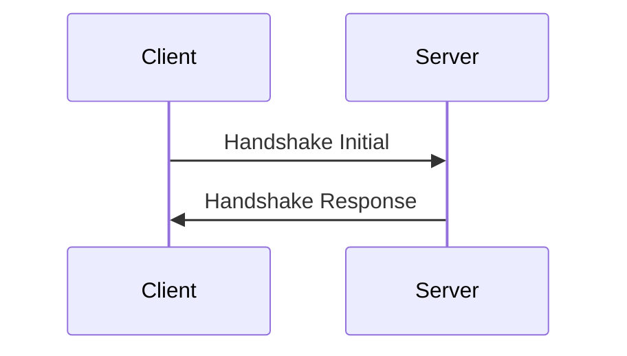
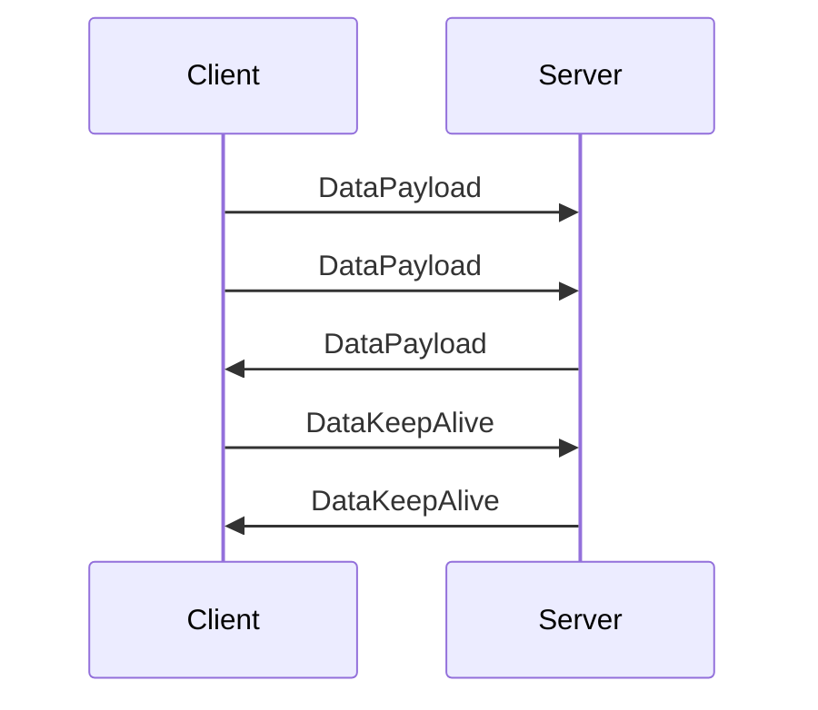

# Holynet VPN


Holynet VPN is a high-performance VPN protocol built with Rust, designed for fast and secure connections over UDP.

* **UDP-based** for low-latency and high-throughput communication;
* Can be used as a **library** for integrating VPN functionality into custom applications or services;
* Supports two cryptographic algorithms based on the **Noise IK+PSK2 protocol**: clients can choose between **AES** or **ChaCha** encryption depending on the device, such as mobile devices;
* Cross-platform support for **Linux**, **macOS**, (and Windows planned);
* **Optimized for performance** with minimal impact on speed and overhead.

## Usage
```
Usage: server [OPTIONS] <COMMAND>

Commands:
  start    Start VPN server
  users    Users management
  monitor  Monitor VPN server
  logs     Shows VPN server logs
  help     Print this message or the help of the given subcommand(s)

Options:
  -d, --debug          Turn debugging information on
  -c, --config <FILE>  
  -h, --help           Print help
  -V, --version        Print version
```
```
Usage: client-cli [OPTIONS] <COMMAND>

Commands:
  connect  connect to a server
  help     Print this message or the help of the given subcommand(s)

Options:
  -d, --debug    Turn debugging information on
  -h, --help     Print help
  -V, --version  Print version
```

## Protocol schema

### Handshake

#### Handshake Initial
```text
0      8      24                              N  bit
┌──────┬───────┬──────────────────────────────┐     
│ TYPE │  LEN  │      HANDSHAKE PAYLOAD       │     
│ 0x00 │   N   │         (ENCRYPTED)          │     
│(8bit)│(16bit)│          (N-24bit)           │     
└──────┴───────┴──────────────────────────────┘   
```

#### Handshake Response
```text
                              0      8      24                              N  bit
                              ┌──────┬───────┬──────────────────────────────┐     
                              │ TYPE │  LEN  │      HANDSHAKE PAYLOAD       │     
                              │ 0x01 │   N   │         (ENCRYPTED)          │     
                              │(8bit)│(16bit)│          (N-24bit)           │     
                              └──────┴───────┴──────────────┬───────────────┘     
                                                            │                     
                                                            │                     
                                                            ▼                     
                                                                                  
                                                                                  
                                            0      8      40     48        80     
                                            ┌──────┬───────┬──────┬─────────┐     
                                            │ TYPE │       │ TYPE │         │     
                                        ┌── │ 0x00 │  SID  │ 0x00 │  IPv4   │     
                                        │   │(8bit)│(32bit)│(8bit)│ (32bit) │     
                                        │   └──────┴───────┴──────┴─────────┘     
                       ┌──    COMPLETE  │   0      8      40     48       176     
                       │                │   ┌──────┬───────┬──────┬─────────┐     
                       │                │   │ TYPE │       │ TYPE │         │     
                       │                └── │ 0x00 │  SID  │ 0x01 │  IPv6   │     
                       │                    │(8bit)│(32bit)│(8bit)│ (128bit)│     
                       │                    └──────┴───────┴──────┴─────────┘     
                       │                                                          
                       │                                  MaxConnectedDevices     
HandshakeResponderBody │                    0      8      40     48        80     
                       │                    ┌──────┬───────┬──────┬─────────┐     
                       │                    │ TYPE │       │ TYPE │         │     
                       │                ┌── │ 0x00 │  SID  │ 0x00 │  IPv4   │     
                       │                │   │(8bit)│(32bit)│(8bit)│ (32bit) │     
                       │                │   └──────┴───────┴──────┴─────────┘     
                       │                │                    ServerOverloaded     
                       │                │   0      8                              
                       │                │   ┌──────┐                              
                       │                │   │ TYPE │                              
                       └──   DISCONNECT ├── │ 0x01 │                              
                                        │   │(8bit)│                              
                                        │   └──────┘                              
                                        │                          Unexpected     
                                        │   0      8      72                N     
                                        │   ┌──────┬───────┬────────────────┐     
                                        │   │ TYPE │  LEN  │                │     
                                        └── │ 0x02 │   N   │      TEXT      │     
                                            │(8bit)│(64bit)│                │     
                                            └──────┴───────┴────────────────┘     
```
### Data

#### DataClient


#### DataServer