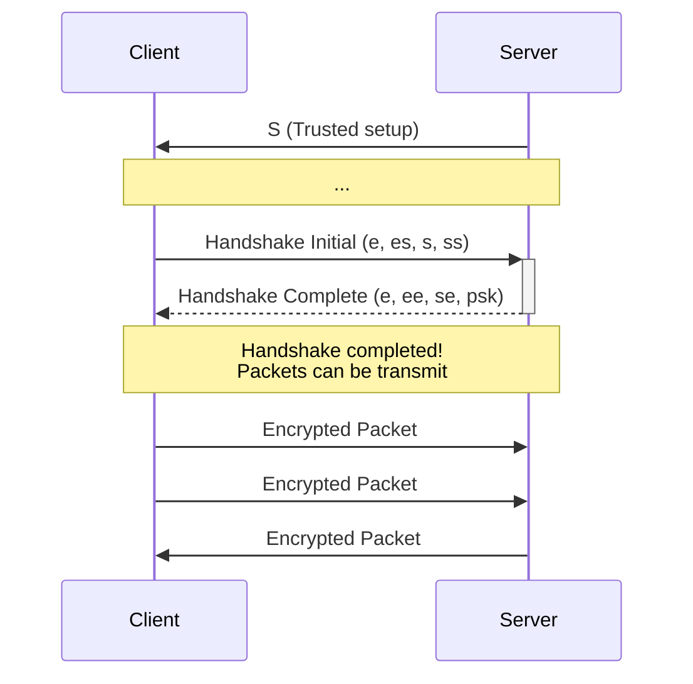
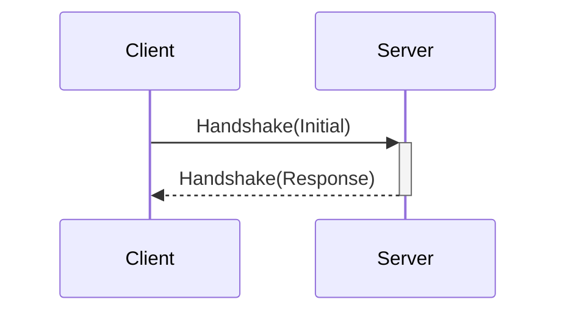
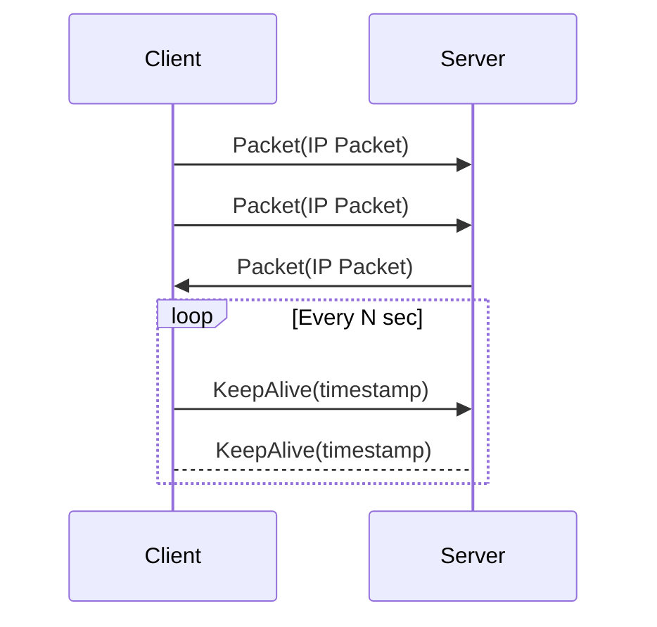

# Holynet VPN


Holynet VPN is a high-performance VPN protocol built with Rust, designed for fast and secure connections over UDP.

* **UDP-based** for low-latency and high-throughput communication;
* Can be used as a **library** for integrating VPN functionality into custom applications or services;
* Supports two cryptographic algorithms based on the **Noise IK+PSK2 protocol**: clients can choose between **AES** or **ChaCha** encryption depending on the device, such as mobile devices;
* Cross-platform support for **Linux**, **macOS**, (and Windows planned);
* **Optimized for performance** with minimal impact on speed and overhead.

## Usage
```
Usage: server [OPTIONS] <COMMAND>

Commands:
  start    Start VPN server
  users    Users management
  monitor  Monitor VPN server
  logs     Shows VPN server logs
  help     Print this message or the help of the given subcommand(s)

Options:
  -d, --debug          Turn debugging information on
  -c, --config <FILE>  
  -h, --help           Print help
  -V, --version        Print version
```
```
Usage: client-cli [OPTIONS] <COMMAND>

Commands:
  connect  connect to a server
  help     Print this message or the help of the given subcommand(s)

Options:
  -d, --debug    Turn debugging information on
  -h, --help     Print help
  -V, --version  Print version
```

## Protocol schema

### Handshake
The responder is initialized with a pre-shared long-term static key, which is assumed 
to be pre-authenticated out of band by the initiator.



**Message A show detailed analysis**  
Message A, sent by the initiator, benefits from receiver authentication but 
is vulnerable to Key Compromise Impersonation. If the responder's long-term 
private key has been compromised, this authentication can be forged. However, 
if the initiator carries out a separate session with a separate, compromised 
responder, this other session can be used to forge the authentication of this 
message with this session's responder. Message contents benefit from message 
secrecy and some forward secrecy: the compromise of the responder's long-term 
private keys, even at a later date, will lead to message contents being decrypted 
by the attacker.

**Message B show detailed analysis**  
Message B, sent by the responder, benefits from sender and receiver authentication 
and is resistant to Key Compromise Impersonation. Assuming the corresponding private 
keys are secure, this authentication cannot be forged. Message contents benefit from 
message secrecy and weak forward secrecy under an active attacker: if the responder's 
long-term static keys were previously compromised, the later compromise of the 
initiator's long-term static keys can lead to message contents being decrypted 
by an active attacker, should that attacker also have forged the initiator's 
ephemeral key during the session.

**Message C show detailed analysis**  
Message C, sent by the initiator, benefits from sender and receiver authentication and 
is resistant to Key Compromise Impersonation. Assuming the corresponding private keys 
are secure, this authentication cannot be forged. Message contents benefit from message 
secrecy and strong forward secrecy: if the ephemeral private keys are secure and the 
responder is not being actively impersonated by an active attacker, message contents 
cannot be decrypted.

**Message D show detailed analysis**  
Message D, sent by the responder, benefits from sender and receiver authentication and 
is resistant to Key Compromise Impersonation. Assuming the corresponding private keys 
are secure, this authentication cannot be forged. Message contents benefit from message 
secrecy and strong forward secrecy: if the ephemeral private keys are secure and the 
initiator is not being actively impersonated by an active attacker, message contents 
cannot be decrypted.

[[more here]](https://noiseexplorer.com/patterns/IKpsk2)

**Noise IKpsk2**



#### Handshake Initial
```text
0      8        24                                            792  bit
┌──────┬─────────┬──────────────────────────────────────────────┐     
│ TYPE │   LEN   │              NOISE METADATA                  │     
│ 0x01 │    N    │                (ENCRYPTED)                   │     
│(8bit)│ (16bit) │                 (768 bit)                    │     
└──────┴─────────┴──────────────────────────────────────────────┘     
```

#### Handshake Response
```text
0      8        24                                              N  bit
┌──────┬─────────┬──────────────────────────────────────────────┐     
│ TYPE │   LEN   │    HANDSHAKE PAYLOAD + NOISE METADATA        │     
│ 0x01 │    N    │                (ENCRYPTED)                   │     
│(8bit)│ (16bit) │                 (N-24bit)                    │     
└──────┴─────────┴──────────────────────────────────────────────┘     
                 0      8      40                                     
                 ┌──────┬───────┬───────────────────────────────┐     
                 │ TYPE │       │                               │     
       COMPLETE  │ 0x00 │  SID  │            IP ADDR            │     
                 │(8bit)│(32bit)│                               │     
                 └──────┴───────┴───────────────────────────────┘     
                               40     48                 176          
                                ┌──────┬───────────────────┐          
                                │ TYPE │                   │          
                                │ 0x01 │        IPv6       │          
                                │(8bit)│      (128bit)     │          
                                └──────┴───────────────────┘          
                               40     48          80                  
                                ┌──────┬───────────┐                  
                                │ TYPE │           │                  
                                │ 0x00 │   IPv4    │                  
                                │(8bit)│  (32bit)  │                  
                                └──────┴───────────┘                  
                                                                      
                 0      8                                             
                 ┌──────┬───────────────────────────────────────┐     
                 │ TYPE │                                       │     
     DISCONNECT  │ 0x01 │               REASON                  │     
                 │(8bit)│                                       │     
                 └──────┴───────────────────────────────────────┘     
                        8     16      80                              
                        ┌──────┬───────┬────────────────────────┐     
                        │ TYPE │  LEN  │           TEXT         │     
            Unexpected  │ 0x02 │   X   │           UTF-8        │     
                        │(8bit)│(64bit)│         (X-80bit)      │     
                        └──────┴───────┴────────────────────────┘     
                        8     16      46                              
                        ┌──────┬───────┐                              
                        │ TYPE │       │                              
   MaxConnectedDevices  │ 0x00 │ COUNT │                              
                        │(8bit)│(32bit)│                              
                        └──────┴───────┘                              
                                                                      
                        8     16                                      
                        ┌──────┐                                      
                        │ TYPE │                                      
      ServerOverloaded  │ 0x01 │                                      
                        │(8bit)│                                      
                        └──────┘                                      
```

### Data


#### DataClient
```text
0      8      40      56                      N  bit                        
┌──────┬───────┬───────┬──────────────────────┐                             
│ TYPE │  SID  │  LEN  │     DATA PAYLOAD     │                             
│ 0x02 │       │   N   │      (ENCRYPTED)     │                             
│(8bit)│(32bit)│(16bit)│       (N-56bit)      │                             
└──────┴───────┴───────┴──────────┬───────────┘                             
                                  │                                         
                                  │                                         
                                  │                                         
                                  │                                         
                                                                            
                           DataClientBody                                   
                                                                            
                                  │                                         
                                  │                                         
                                  │                                         
                                  │                                         
                                  │                                         
                                  │               0      16                N
                                  │               ┌───────┬────────────────┐
                                  │               │  LEN  │      BYTES     │
                                  ├────  PACKET   │   N   │                │
                                  │       0x00    │(16bit)│     (N-16bit)  │
                                  │               └───────┴────────────────┘
                                  │                                         
                                  │               0                      128
                                  │               ┌────────────────────────┐
                                  │               │    CLIENT TIMESTAMP    │
                                  └──── KEEPALIVE │         micros         │
                                          0x01    │        (128bit)        │
                                                  └────────────────────────┘
                                                                           
                                                                           
                                                                           
                                                                           
                                                         
 
```

#### DataServer
```text
0      8      24                              N  bit                     
┌──────┬───────┬──────────────────────────────┐                          
│ TYPE │  LEN  │         DATA PAYLOAD         │                          
│ 0x03 │   N   │          (ENCRYPTED)         │                          
│(8bit)│(16bit)│           (N-24bit)          │                          
└──────┴───────┴──────────────┬───────────────┘                          
                              │                                          
                              │                                          
                              │                                          
                              │                                          
                                                                         
                       DataClientBody                                    
                                                                         
                              │                                          
                              │                                          
                              │                                          
                              │                                          
                              │                                          
                              │                0      16                N
                              │                ┌───────┬────────────────┐
                              │                │  LEN  │      BYTES     │
                              ├────  PACKET    │   N   │                │
                              │       0x00     │(16bit)│    (N-16bit)   │
                              │                └───────┴────────────────┘
                              │                                          
                              │                0                      128
                              │                ┌────────────────────────┐
                              │                │    CLIENT TIMESTAMP    │
                              ├──── KEEPALIVE  │         micros         │
                              │       0x01     │        (128bit)        │
                              │                └────────────────────────┘
                              │                                          
                              │                0        8                 
                              │                ┌────────┐                 
                              │                │  CODE  │                 
                              └──── Disconnect │        │                 
                                      0x02     │ (8bit) │                 
                                               └────────┘                 
```
