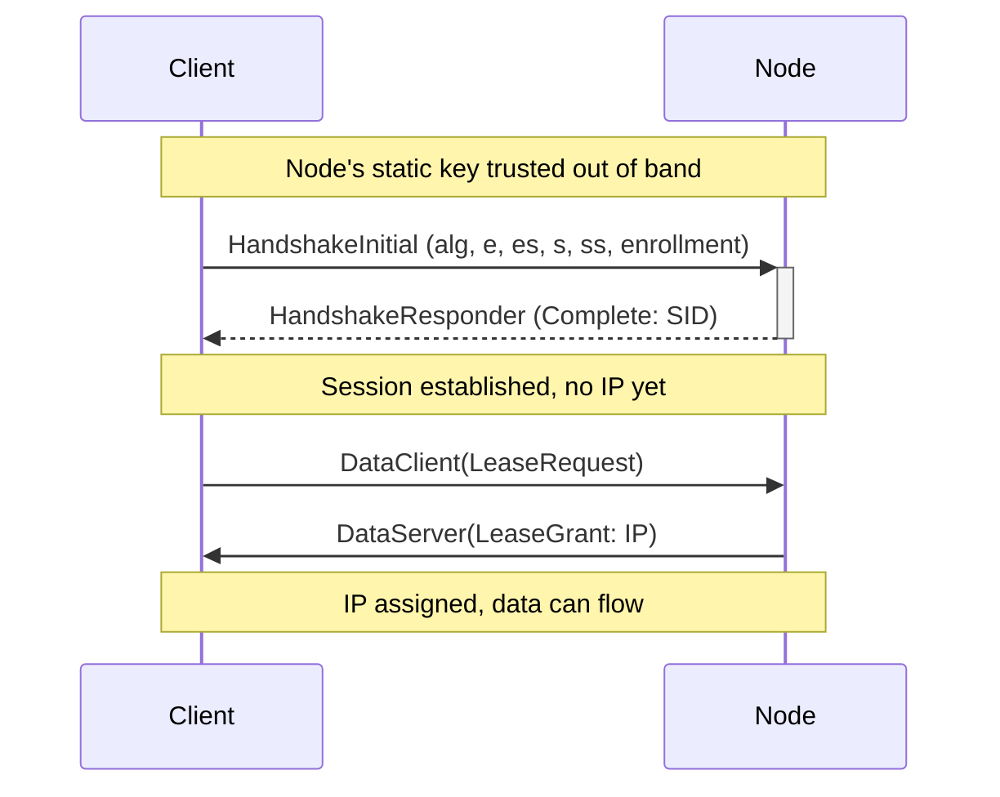

# Holynet protocol

The wire protocol for Holynet VPN. UDP transport, Noise IKpsk2 sessions, and a
small set of top-level frame types that cover the data path, a control channel,
node-to-node gossip, liveness, and transparent relaying.

The model is managed multi-node (closer to Tailscale or Nebula than to stateless
WireGuard). Address space is partitioned per node, coordination is kept off the
packet hot path, and the registry converges as an AP CRDT with no cross-node
consensus. One server with many clients is just the single-node case.

## Top-level frames

Every datagram starts with a one-byte type tag (a bincode varint, so values
0..=9 are a single byte). The tag selects the frame:

| Tag  | Frame            | Direction        | Encrypted | Purpose                                   |
|------|------------------|------------------|-----------|-------------------------------------------|
| 0x00 | HandshakeInitial | client to node   | Noise     | Open a session, carry the device enrollment |
| 0x01 | HandshakeResponder | node to client | Noise     | Complete the session (returns the SID)    |
| 0x02 | DataClient       | client to node   | Noise     | Data payload and client control bodies    |
| 0x03 | DataServer       | node to client   | Noise     | Data payload and node control bodies      |
| 0x04 | NodeSync         | node to node     | no (signed records) | Registry anti-entropy gossip    |
| 0x05 | NodePing         | any to node      | no        | Liveness probe, reflected verbatim        |
| 0x06 | RelayOpen        | client to relay  | no        | Ask a relay to open a path to a node      |
| 0x07 | RelayOpened      | relay to client  | no        | Relay reply (relay_id, 0 means refused)   |
| 0x08 | RelayData        | both             | no (opaque payload) | Relayed ciphertext                |
| 0x09 | NodeEdges        | node to node     | no (unsigned hints) | Routing overlay gossip            |

Frames 0x04..0x09 are not Noise-encrypted at the transport layer. NodeSync and
NodeEdges carry their own trust (see below). RelayData carries an opaque inner
frame that is itself a client-to-node Noise session, so the relay never sees
plaintext.

## Handshake (0x00, 0x01)

Noise IKpsk2. The responder holds a per-account pre-shared static key, assumed
pre-authenticated out of band. The client can pick the AEAD:

- `0x01` AES-256-GCM (`Noise_IKpsk2_25519_AESGCM_BLAKE2s`)
- `0x02` ChaCha20-Poly1305 (`Noise_IKpsk2_25519_ChaChaPoly_BLAKE2s`)



### HandshakeInitial

```text
0      8        24      32                                    N  bit
┌──────┬─────────┬───────┬──────────────────────────────────────┐
│ TYPE │   LEN   │  ALG  │            NOISE METADATA             │
│ 0x00 │    N    │       │              (ENCRYPTED)              │
│(8bit)│ (16bit) │(8bit) │                                       │
└──────┴─────────┴───────┴───────────────────────────────────────┘
```

The NOISE METADATA carries the device enrollment (see below), so the node can
attribute a device to an account without pre-provisioning every device key. The
enrollment sits in the first Noise message payload, where the psk is not yet
mixed (IKpsk2 mixes the psk in the second message), so the node reads it before
applying the psk.

### HandshakeResponder

The response body is either `Complete` (session id only) or a `Disconnect`
carrying a typed error. Note the difference from earlier versions: the IP address
is no longer in the handshake. A session exists first, and the address is leased
on demand over the control channel.

```text
0      8        24                                              N  bit
┌──────┬─────────┬──────────────────────────────────────────────┐
│ TYPE │   LEN   │       HANDSHAKE BODY + NOISE METADATA          │
│ 0x01 │    N    │                (ENCRYPTED)                     │
│(8bit)│ (16bit) │                                                │
└──────┴─────────┴────────────────────────────────────────────────┘
                 0      8      40
                 ┌──────┬───────┐
       COMPLETE  │ 0x00 │  SID  │
                 │(8bit)│(32bit)│
                 └──────┴───────┘

                 0      8
                 ┌──────┬─────────────────────┐
     DISCONNECT  │ 0x01 │        ERROR         │
                 │(8bit)│                      │
                 └──────┴─────────────────────┘
                        ERROR variants:
                        0x00 MaxConnectedDevices(u32 count)
                        0x01 ServerOverloaded
                        0x02 Unexpected(utf8 text)
```

### Device enrollment

Each device has its own Noise keypair. An account (master) key signs an
enrollment binding the device key, its index, capabilities, and expiry. The node
verifies the signature against the account public key. This gives device numbering,
per-device address pinning, revocation, and offline enrollment.

Fixed 144-byte layout, little-endian integers, the signature covers the first 80
bytes:

```text
0        256      512      544      576              640           1152  bit
┌─────────┬────────┬────────┬────────┬────────────────┬──────────────┐
│ ACCOUNT │ DEVICE │ DEV IX │  CAPS  │     EXPIRY      │  SIGNATURE   │
│ PK (256)│ PK(256)│  (32)  │  (32)  │  (64, unix,     │  (512, ed25519│
│ ed25519 │ x25519 │        │        │   0 = never)    │  over [0..80))│
└─────────┴────────┴────────┴────────┴────────────────┴──────────────┘
```

## Data and the control channel (0x02, 0x03)

Data frames carry a fixed-size header and no length field: the encrypted payload
runs to the end of the datagram (like WireGuard). Fixed size keeps a batch of
equal-size packets byte-uniform, so they go out in one `sendmsg` with UDP GSO
(`UDP_SEGMENT`) and are split by the kernel.

`NONCE` is a monotonically increasing counter set by the sender, used as the AEAD
nonce (Noise `StatelessTransportState`). The receiver checks it against a sliding
anti-replay window (2048 bits) before decrypting.

The client control channel does not use its own frame type. It piggybacks on the
existing Data frames as inner (encrypted) bodies, reusing the session keys,
nonce, anti-replay, and receive workers. So `LeaseRequest` can go out as the very
first client Data frame (nonce 0), right after the handshake.

```text
DataClient (0x02):
0      8      40                   104                                 N  bit
┌──────┬───────┬────────────────────┬─────────────────────────────────────┐
│ TYPE │  SID  │       NONCE        │        BODY + NOISE METADATA         │
│ 0x02 │(32bit)│      (64bit)       │              (ENCRYPTED)             │
└──────┴───────┴────────────────────┴─────────────────────────────────────┘
  inner DataClientBody:
    0x00 Packet(ip bytes)   0x01 KeepAlive(u128 micros)
    0x02 LeaseRequest       0x03 NodeListRequest       0x04 EdgeListRequest

DataServer (0x03):
0      8                    72                                         N  bit
┌──────┬─────────────────────┬───────────────────────────────────────────┐
│ TYPE │        NONCE        │            BODY + NOISE METADATA           │
│ 0x03 │       (64bit)       │                (ENCRYPTED)                 │
└──────┴─────────────────────┴─────────────────────────────────────────────┘
  inner DataServerBody:
    0x00 Packet(ip bytes)   0x01 KeepAlive(u128)   0x02 Disconnect(u8 code)
    0x03 LeaseGrant(IpAddr)  0x04 NodeList(Vec<NodeEntry>)  0x05 EdgeList(Vec<EdgeMetric>)
```

`LeaseGrant(IpAddr)` carries the address in serde IpAddr layout (variant 0 = V4
4 bytes, 1 = V6 16 bytes). `NodeList` and `EdgeList` are rare owned control
replies, decoded with full bincode rather than the zero-copy data path. Pool
exhaustion answers `LeaseRequest` with a `Disconnect`.

## Node-to-node gossip: NodeSync (0x04)

Registry anti-entropy. A node periodically pushes its full signed record set to
every active peer. Records are self-authenticating, so a peer merges them straight
into its CRDT registry and rejects anything not signed by the trusted authority.
This is what lets untrusted relays carry the registry without being able to forge
it. Push-only epidemic: seed one node, records spread transitively.

```text
NodeSync (0x04): 0x04 │ bincode(Vec<NodeRecord>)   to end of datagram

NodeRecord:
  NodeEntry │ VERSION(u64 LWW) │ REVOKED(bool tombstone) │ AUTHORITY(ed25519 pk)
  │ SIGNATURE(512, ed25519 over bincode(entry, version, revoked))

NodeEntry:
  NODE_PK(x25519) │ ENDPOINT(SocketAddr) │ SUBNET(base ip) │ PREFIX(u8) │ LABEL(utf8)
```

`VERSION` (unix millis) is the last-writer-wins tag: merges are deterministic on
`(version, signature)` and converge after a partition heals without consensus.
Revocation is a tombstone (hidden from the active set but still gossiped) and is
reaped only after a long TTL, well past the longest survivable partition.

## Liveness: NodePing (0x05)

```text
NodePing (0x05): 0x05 │ nonce(u64 BE)
```

Any node reflects the frame verbatim to the sender. A client sends it to the
endpoints from `NodeList` on its own ephemeral socket and measures rtt and
reachability from its own vantage point (important under censorship: a node may
see a peer that a client in a blocked country cannot). alive/rtt is an overlay,
not a durable field of `NodeEntry`.

## Transparent relay: RelayOpen/Opened/Data (0x06, 0x07, 0x08)

An untrusted, TURN-like relay. The client keeps an end-to-end Noise session with
the final node; the relay only shuttles opaque ciphertext.

```text
RelayOpen   (0x06):  0x06 │ dest_pk(32)          client -> relay
RelayOpened (0x07):  0x07 │ relay_id(u32 BE)     relay  -> client  (0 = refused)
RelayData   (0x08):  0x08 │ relay_id(u32 BE) │ payload   both directions
```

On `RelayOpen` the relay resolves `dest_pk` through its registry (so it only ever
forwards to a known node, never an arbitrary host), binds an ephemeral socket to
that destination, and returns a `relay_id`. It then keeps
`relay_id -> (client_addr, dest, socket)`, with `client_addr` pinned at open time
so a guessed `relay_id` cannot hijack the reverse path. `payload` is an opaque
inner frame (a full client-to-node handshake or data frame); the relay never
reads it.

Multi-hop is nesting: N `RelayData` layers over one socket, `ids[0]` outermost.
Each relay strips exactly its own layer and forwards the rest, so depth is
arbitrary and the nodes need no changes.

```text
dests = [R2, R3, ..., server]   (the client dials R1)
send : [RD id0][RD id1]...[RD idn][ payload ]
R1 strips id0 -> R2 strips id1 -> ... -> server gets the inner frame
```

## Routing overlay: NodeEdges (0x09)

The client picks the multi-hop path itself, but it can only measure its own
first-hop rtt. Nodes fill the gap: each probes its peers with `NodePing` and
gossips an ephemeral overlay of inter-node edges. The client fetches it with
`EdgeListRequest`, combines it with its own probes, and runs a shortest-path
search to the target.

```text
NodeEdges (0x09): 0x09 │ bincode(Vec<EdgeMetric>)   to end of datagram

EdgeMetric:
  FROM(pk) │ TO(pk) │ RTT_MICROS(Option<u32>, None = probed but silent) │ UPDATED_MS(u64)
```

Edges are unsigned soft hints, merged last-writer-wins per `(from, to)` on
`updated_ms`. They are not durable and never affect data-plane correctness: they
only bias path selection, and the end-to-end Noise session still protects the
payload. A forged edge can at most skew routing, not read traffic.

## Notes on trust

- Data confidentiality and integrity: Noise IKpsk2, end to end between client and
  the terminating node, even across relays.
- Registry authenticity: each `NodeRecord` is signed by the network authority.
  Any node accepts a record from any peer once the signature checks out, which is
  what makes untrusted relaying safe.
- Routing overlay: unsigned, best-effort hints. Trust boundary is deliberately
  low because the overlay cannot affect correctness.
